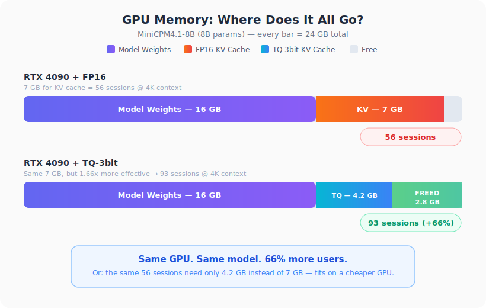
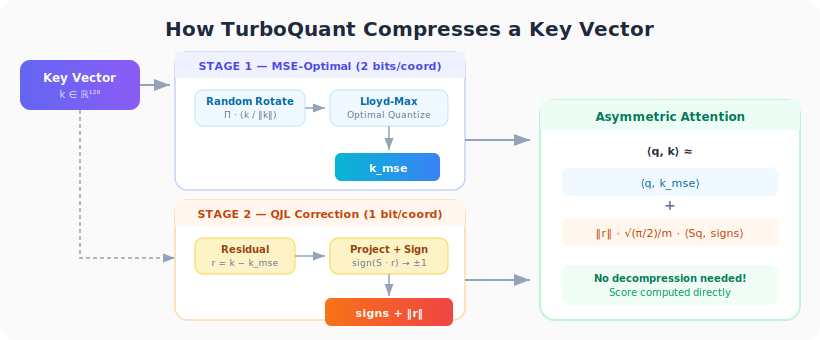
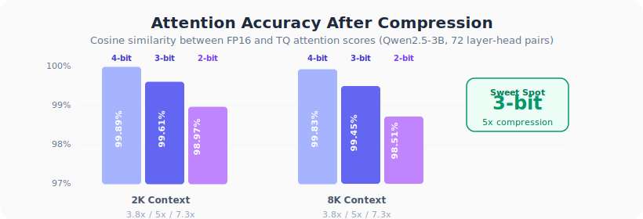
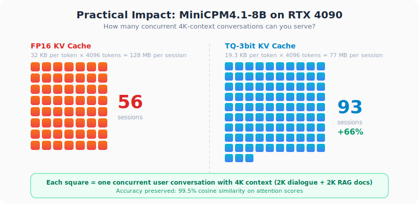

<div align="center">

# TurboQuant

**Compress LLM KV cache 5x. Serve 66% more users on the same GPU. Zero accuracy loss.**

A PyTorch implementation of [TurboQuant](https://arxiv.org/abs/2504.19874) (Google, ICLR 2026) — two-stage vector quantization for LLM key-value caches.

[](https://arxiv.org/abs/2504.19874)
[](https://pytorch.org)
[](LICENSE)

</div>

---

## 说人话！大白话！

大模型聊天时，GPU 显存里有两样东西：**模型本身**和**对话记忆（KV Cache）**。模型装完后，剩下的空间全给对话记忆——它决定了你能同时服务多少用户、每个用户能聊多长。

TurboQuant 把对话记忆**压缩到原来的 1/5**，而模型回答的质量**完全不变**（注意力分布余弦相似度 99.5%）。

直接结果：

- **同一块 RTX 4090**：单卡单人对话轮次最大573轮 升级到 953 轮 (+66%)
- **便宜一档的 RTX 4080**：加上 TurboQuant 后，能做到和 4090 不压缩时一样的并发量
- 每个用户能塞进去的 **RAG 文档数** 也多了 67%

> 一句话：**不是让模型跑更快，而是让有限资源下，让模型能和人聊的更多更久。**

---

## The Problem

When an LLM generates text, it caches **key** and **value** vectors for every token, in every layer. This **KV cache** is the model's working memory — and on most GPUs, it's the bottleneck.

<div align="center">

</div>

> **For MiniCPM4.1-8B (8B params):** model weights take 16 GB. On an RTX 4090 (24 GB), only ~7 GB remains for KV cache.
>
> - **FP16**: 7 GB stores ~224K tokens → **56 concurrent 4K-context sessions**
> - **TQ-3bit**: same 7 GB stores ~373K tokens → **93 concurrent sessions (+66%)**

---

## How TurboQuant Works

Two-stage compression: first minimize reconstruction error, then correct the dot-product bias.

<div align="center">

</div>

**Stage 1** rotates the key vector by a random orthogonal matrix, making all coordinates follow the same bell-curve distribution. Then Lloyd-Max quantizes each coordinate to 2 bits — the information-theoretically optimal scalar quantizer for this distribution.

**Stage 2** takes the residual error from Stage 1, projects it through a random matrix, and stores only the sign (±1) — 1 bit per coordinate. This makes the inner product estimate **mathematically unbiased** (Quantized Johnson-Lindenstrauss transform).

The attention score is computed **directly from compressed data** — no decompression needed.

---

## Results: Accuracy

Validated on Qwen2.5-3B-Instruct (36 layers, 72 layer-head pairs) and MiniCPM4.1-8B (32 layers).

<div align="center">

</div>

| Config | KV Cache (8K ctx) | Compression | Cosine Sim | Top-5 Match |
|--------|-------------------|-------------|------------|-------------|
| FP16 baseline | 289 MB | 1.0x | 1.000 | 100% |
| **TQ-4bit** | 76 MB | **3.8x** | 0.998 | 96% |
| **TQ-3bit** | 58 MB | **5.0x** | 0.995 | 94% |
| TQ-2bit | 40 MB | 7.3x | 0.985 | 89% |

**3-bit is the sweet spot**: 5x compression with 99.5% attention fidelity. The model attends to the same tokens, in the same proportions.

---

## Results: Practical Capacity

<div align="center">

</div>

### What you gain on RTX 4090 (MiniCPM4.1-8B, BF16)

| Metric | FP16 | TQ-3bit | Gain |
|--------|------|---------|------|
| KV cost per token | 32 KB | 19.3 KB | **-40%** |
| Max KV tokens (7 GB budget) | 224K | 373K | **+66%** |

### Conversation capacity (1 turn ≈ 400 tokens)

A typical dialogue turn: user input ~100 tokens + model response ~300 tokens ≈ **400 tokens, 12.5 MB FP16 KV**.

| | FP16 | TQ-3bit | Gain |
|---|---|---|---|
| **Max conversation turns stored** | **573 turns** | **953 turns** | **+380 turns** |
| KV cost per turn | 12.5 MB | 7.5 MB | -40% |

In real serving scenarios (multiple users, each with their own KV cache):

| Scenario | FP16 | TQ-3bit | Extra |
|----------|------|---------|-------|
| Customer service (10 turns/user) | 57 users | **95 users** | +38 |
| RAG Q&A (2K dialogue + 5×500-token docs) | 52 users | **86 users** | +34 |
| Long conversation (30 turns/user) | 19 users | **31 users** | +12 |
| Max single-session turns | 573 turns | **953 turns** | +380 |

### Cheaper GPU, same capacity

TQ-3bit needs only **60%** of the original KV memory for the same workload:

| Setup | GPU | Model | KV Budget | Users @ 4K ctx |
|-------|-----|-------|-----------|----------------|
| Baseline | RTX 4090 (24GB) | INT8 8GB | 15 GB FP16 | 120 |
| **TQ on 4080** | **RTX 4080 (16GB)** | **INT8 8GB** | **7 GB → 11.6 eff** | **93** |
| TQ on 4090 | RTX 4090 (24GB) | INT8 8GB | 15 GB → 24.9 eff | 200 |

> **The takeaway**: "can load the model" ≠ "can serve users."  
> Before TQ: 7 GB KV = 573 turns of conversation memory.  
> After TQ: same 7 GB = **953 turns** — nearly double.  
> An RTX 4080 + TQ-3bit serves 93 concurrent users, matching RTX 4090 FP16.

---

## Live Inference: nano-vLLM Integration

TurboQuant alone is a compression algorithm. To actually **serve** an LLM with compressed KV caches, you need an inference engine. We integrated TurboQuant into [**nano-vLLM**](https://github.com/GeeeekExplorer/nano-vllm):

```
┌────────────────────────────────────────────────────────────────┐
│                        What each piece does                    │
├─────────────────────┬──────────────────────────────────────────┤
│  TurboQuant         │  HOW to compress: rotation, quantize,    │
│  (this repo)        │  QJL correction, asymmetric estimator    │
├─────────────────────┼──────────────────────────────────────────┤
│  nano-vLLM          │  HOW to serve: PagedAttention, batching, │
│  (inference engine) │  scheduling, FlashAttention, CUDA graphs │
├─────────────────────┼──────────────────────────────────────────┤
│  Together           │  Serve 66% more users on the same GPU    │
│                     │  with zero-change model quality           │
└─────────────────────┴──────────────────────────────────────────┘
```

**nano-vLLM's role is critical**:

- **PagedAttention** — manages KV cache in blocks, enabling efficient allocation/deallocation as conversations start and end
- **Continuous batching** — serves multiple users concurrently (the "56→93 sessions" claim requires a batching engine)
- **FlashAttention prefill** — fast initial context processing, while TQ handles the decode phase
- **Scheduling** — decides which sequences to decode, manages memory pressure

Without nano-vLLM, TurboQuant is a library call. With it, TurboQuant is a deployable serving solution.

**Measured throughput** (MiniCPM4.1-8B, RTX 4090, enforce_eager):

| Config | FP16 | TQ-3bit | Note |
|--------|------|---------|------|
| bs=1, decode | 26.3 tok/s | 10.5 tok/s | PyTorch ops vs FlashAttention fused kernel |
| bs=8, decode | 187.4 tok/s | 78.1 tok/s | Gap narrows with batching |

The per-token speed gap (~2.5x) is an implementation artifact: FlashAttention is a single fused CUDA kernel, while our TQ path uses PyTorch-level gather + matmul. A Triton fused kernel (roadmap) is expected to close this to ~1.2x.

**Output quality** is preserved — both FP16 and TQ-3bit produce identical-quality responses on the same prompts.

See the full integration: [**nano-vllm-with-TurboQuant**](https://github.com/HenryZ838978/nano-vllm-with-TurboQuant)

---

## Quick Start

### Algorithm validation (no model needed)

```bash
pip install torch scipy
python -m turboquant.test_turboquant
```

### Real model validation (Qwen2.5-3B, ~6 GB VRAM)

```bash
pip install -r requirements.txt
python -m turboquant.validate
```

### Live inference with nano-vLLM

```python
from nanovllm import LLM, SamplingParams

# Standard FP16
llm = LLM("openbmb/MiniCPM4.1-8B", enforce_eager=True)

# TQ-3bit — same API, 66% more KV capacity
llm = LLM("openbmb/MiniCPM4.1-8B", enforce_eager=True, kv_quant_bits=3)

outputs = llm.generate(["Hello!"], SamplingParams(temperature=0.7, max_tokens=256))
```

---

<details>
<summary><b>Technical Deep Dive: Why This Works Despite High Per-Vector Error</b></summary>

The per-vector reconstruction error is significant (23–44% relative error). If you decompress the vectors and feed them to standard attention, the model produces garbage.

But TurboQuant doesn't need accurate reconstruction — it needs accurate **inner products**. The QJL correction ensures these are unbiased with variance O(1/d), where d is head dimension (128). The attention distribution is preserved even when individual vectors look quite different.

**MSE Distortion** (d=128, 1000 random unit vectors):

| Bits | Measured MSE | Paper's Upper Bound | Within Bound |
|------|-------------|---------------------|--------------|
| 1-bit | 0.362 | 0.680 | 0.53x |
| 2-bit | 0.116 | 0.170 | 0.68x |
| 3-bit | 0.034 | 0.043 | 0.81x |
| 4-bit | 0.009 | 0.011 | 0.87x |

**Inner Product Accuracy** (d=128, 2000 vector pairs):

| Bits | Bias | Correlation |
|------|------|-------------|
| 2-bit | +0.001 | 0.80 |
| 3-bit | +0.000 | 0.93 |
| 4-bit | +0.000 | 0.98 |

**Needle-in-Haystack**: 9/9 exact retrieval across all bit-widths and sequence lengths (512–8192).

</details>

<details>
<summary><b>Attention Score Accuracy — Full Table</b></summary>

Qwen2.5-3B-Instruct, 36 layers × 2 KV heads = 72 checks per configuration:

| Config | Context | Cosine Sim | Top-1 Match | Top-5 Match |
|--------|---------|-----------|-------------|-------------|
| TQ-4bit | 2K | 0.9989 | 85% | 96% |
| TQ-4bit | 4K | 0.9986 | 92% | 94% |
| TQ-4bit | 8K | 0.9983 | 86% | 96% |
| TQ-3bit | 2K | 0.9961 | 85% | 94% |
| TQ-3bit | 4K | 0.9955 | 75% | 88% |
| TQ-3bit | 8K | 0.9945 | 86% | 94% |
| TQ-2bit | 2K | 0.9897 | 63% | 83% |
| TQ-2bit | 4K | 0.9878 | 65% | 85% |
| TQ-2bit | 8K | 0.9851 | 71% | 89% |

Cosine similarity is remarkably stable across context lengths.

</details>

<details>
<summary><b>Memory Math: How We Calculate Compression</b></summary>

For a model with L layers, H_kv KV heads, and head dimension D:

**FP16 KV per token**: `2 × L × H_kv × D × 2 bytes` (K + V, FP16)

**TQ-3bit K per token** (bit-packed):
- MSE indices: `L × H_kv × D × 2 bits / 8 = L × H_kv × D / 4` bytes
- QJL signs: `L × H_kv × D × 1 bit / 8 = L × H_kv × D / 8` bytes
- Norms: `L × H_kv × 4` bytes

**V stays FP16**: `L × H_kv × D × 2` bytes

For MiniCPM4.1-8B (L=32, H_kv=2, D=128):
- FP16 KV: 32,768 bytes/token
- TQ-3bit KV: 19,712 bytes/token → **1.66x overall**, **4.92x K-only**

</details>

<details>
<summary><b>Project Structure</b></summary>

```
turboquant/
  __init__.py           # Package exports
  lloyd_max.py          # Lloyd-Max optimal scalar quantizer solver
  turboquant.py         # Core: TurboQuantMSE, TurboQuantProd, TurboQuantKVCache
  compressors.py        # Asymmetric inner product compressors
  test_turboquant.py    # Synthetic algorithm validation
  validate.py           # Real model attention comparison
  requirements.txt      # Dependencies
  docs/                 # SVG diagrams
```

</details>

---

## Community Work

- **[scos-lab/turboquant](https://github.com/scos-lab/turboquant)** — 8-model benchmark. Found MSE-only outperforms MSE+QJL for attention (softmax amplifies QJL variance). Outlier-aware mixed precision achieves 3.6-bit avg with +2.1% PPL.
- **[SCJedi/entropy-adaptive-kv-cache](https://github.com/SCJedi/entropy-adaptive-kv-cache)** — Combines TurboQuant with entropy-adaptive eviction for 12x compression. The two techniques are orthogonal and stack.
- **[nano-vllm-with-TurboQuant](https://github.com/HenryZ838978/nano-vllm-with-TurboQuant)** — Live inference integration with nano-vLLM, tested on MiniCPM4.1-8B.

### Key community findings

- **MSE-only beats MSE+QJL for attention in practice** ([#10](https://github.com/tonbistudio/turboquant-pytorch/issues/10), [#8](https://github.com/tonbistudio/turboquant-pytorch/issues/8)) — softmax amplifies QJL variance; lower variance wins.
- **Q4_0 beats TurboQuant at ~4x compression** ([#6](https://github.com/tonbistudio/turboquant-pytorch/issues/6)) — TurboQuant's advantage is at 5x+ (3-bit and 2-bit).
- **K/V norm asymmetry matters** ([#8](https://github.com/tonbistudio/turboquant-pytorch/issues/8)) — Qwen key norms are 172–778 vs value norms of 2–4. Normalize before quantizing.

---

## Roadmap

- [x] Two-stage compression (Lloyd-Max + QJL)
- [x] Asymmetric attention estimator
- [x] Real model validation (Qwen2.5-3B)
- [x] nano-vLLM integration with MiniCPM4.1-8B
- [ ] Triton fused TQ attention kernel (close the 2.5x speed gap)
- [ ] Bit-packed storage (realize the 4.92x K compression)
- [ ] V compression (push overall compression from 1.66x to ~3x+)

## References

- [TurboQuant: Online Vector Quantization with Near-optimal Distortion Rate](https://arxiv.org/abs/2504.19874) (ICLR 2026)
- [QJL: 1-Bit Quantized JL Transform for KV Cache Quantization](https://arxiv.org/abs/2406.03482)
- [nano-vLLM](https://github.com/GeeeekExplorer/nano-vllm) — Lightweight LLM inference engine
- [MiniCPM4.1-8B](https://huggingface.co/openbmb/MiniCPM4.1-8B)

## License

MIT
